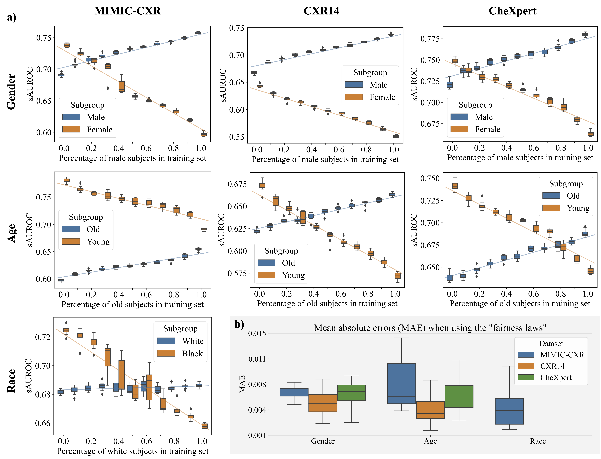
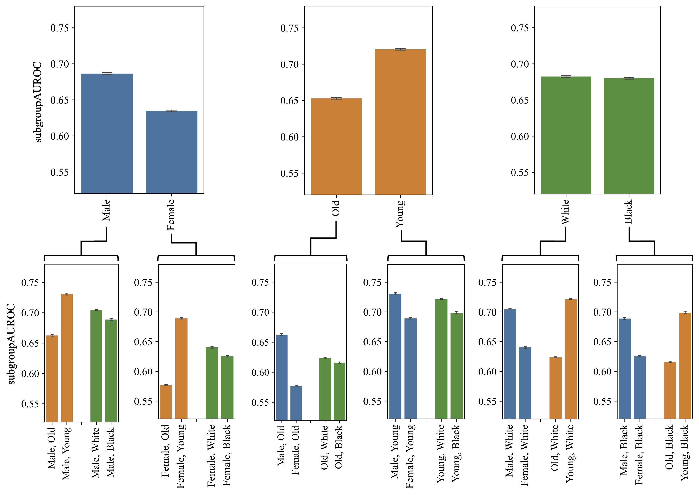
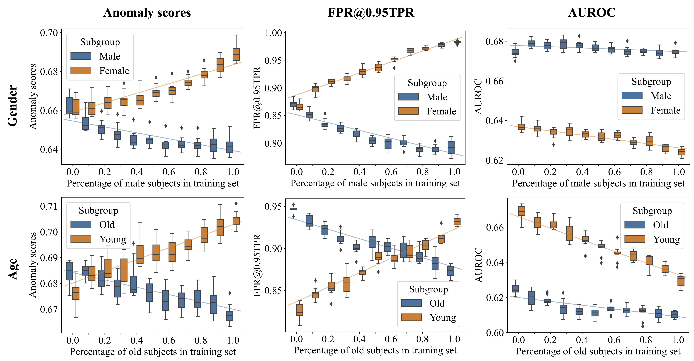

# (Predictable) Performance Bias in Unsupervised Anomaly Detection

This repository contains the code for the paper "(Predictable) Performance Bias in Unsupervised Anomaly Detection" by Felix Meissen, Svenja Breuer, Moritz Knolle, Alena Buyx, Ruth Müller, Georgios Kaissis, Benedikt Wiestler, and Daniel Rückert.

## Setup

### 1. Clone and download

Download this repository by running

```bash
git clone https://github.com/FeliMe/unsupervised_fairness
```

### 2. Environment

Create and activate the Anaconda environment:

```bash
conda env create -f environment.yml
conda activate ad_fairness
```

Additionally, you need to install the repository as a package:

```bash
python3 -m pip install --editable .
```

To be able to use [Weights & Biases](https://wandb.ai) for logging follow the
instructions at [https://docs.wandb.ai/quickstart](https://docs.wandb.ai/quickstart).

### 3. Data

Download the datasets from the respective sources, specify the ```MIMIC_CXR_DIR```,
```CXR14_DIR```, and ```CHEXPERT_DIR``` environment variables, and run the
```src/data/mimic_cxr.py```, ```src/data/cxr14.py```, and ```src/data/chexpert.py```
scripts to prepare the datasets.

Dowload sources:

- [MIMIC-CXR](https://physionet.org/content/mimic-cxr-jpg/2.0.0/)
- [CXR14](https://nihcc.app.box.com/v/ChestXray-NIHCC/folder/36938765345)
- [CheXpert](https://stanfordmlgroup.github.io/competitions/chexpert/)

## Reproduce results

To reproduce the results of the manuscript, make sure the environment is
activated and run the ```./run_experiments.sh``` script.

### Figures 3, 4, and 5

After the experiments are finished, run the ```src/analysis/plot_main.py```
script to which generate the plots necessary to assemble Figures 3a), 4, and 5.
For Figure 3b), additionally ```src/analysis/mae_plot.py``` needs to be ran.

<figure>
  
  <figcaption>Fig. 3: a) A linear relationship between the representation of a subgroup in the training dataset and its performance was observed across all datasets and subgroups. Equal representation of subgroups did not produce the most group-fair results. Experimental results for the FAE on the MIMIC-CXR, CXR14, and CheXpert datasets trained under different gender, age, or race imbalance ratios. Each box extends from the lower to upper quartile values of ten runs with different random seeds with a line at the median. Regression lines along the different imbalance ratios are additionally plotted. The exact numbers can be found in the Appendix. b) The mean absolute errors (MAE) between the real subgroup performances and those estimated using the “fairness laws” for each dataset and protected variable. Each box again shows the results over ten runs with different random seeds.</figcaption>
</figure>

<figure>
  
  <figcaption>Fig. 4: In the MIMIC-CXR dataset, representative of the Beth Israel Deaconess Medical Center, Boston, USA, diseases were detected better in male than female patients and in young than old patients. When considering a second demographic variable, these differences were amplified, e.g. the difference between male and female subjects is larger among older patients than younger ones. Top row: male vs. female, old vs. young, and white vs. black. Bottom row: intersectional subgroups. Each bar shows the mean and standard deviation over ten runs with different random seeds.</figcaption>
</figure>

<figure>
  
  <figcaption>Fig. 5: The representation of a subgroup in the training dataset had a strong influence on its anomaly scores, the false positive rate at a minimally required true positive rate, and our proposed sAUROC (c.f. Fig. 3). Naive computation of AUROC did not capture this relationship. Anomaly scores (left), FPR@0·95TPR (middle), and naive AUROC (right) for different compositions of gender (top) and age (bottom) on the CXR14 dataset.</figcaption>
</figure>


## Acknowledgments

This work was supported by the DAAD programme Konrad Zuse Schools of Excellence
in Artificial Intelligence, sponsored by the Federal Ministry of Education and
Research. Daniel Rueckert has been supported by ERC grant Deep4MI (884622).
Svenja Breuer, Ruth Mu ̈ller and Alena Buyx have been supported via the project
MedAIcine by the Center for Responsible AI Technologies of the Technical
University of Munich, the University of Augsburg, and the Munich School of
Philosophy.
